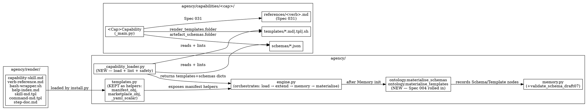
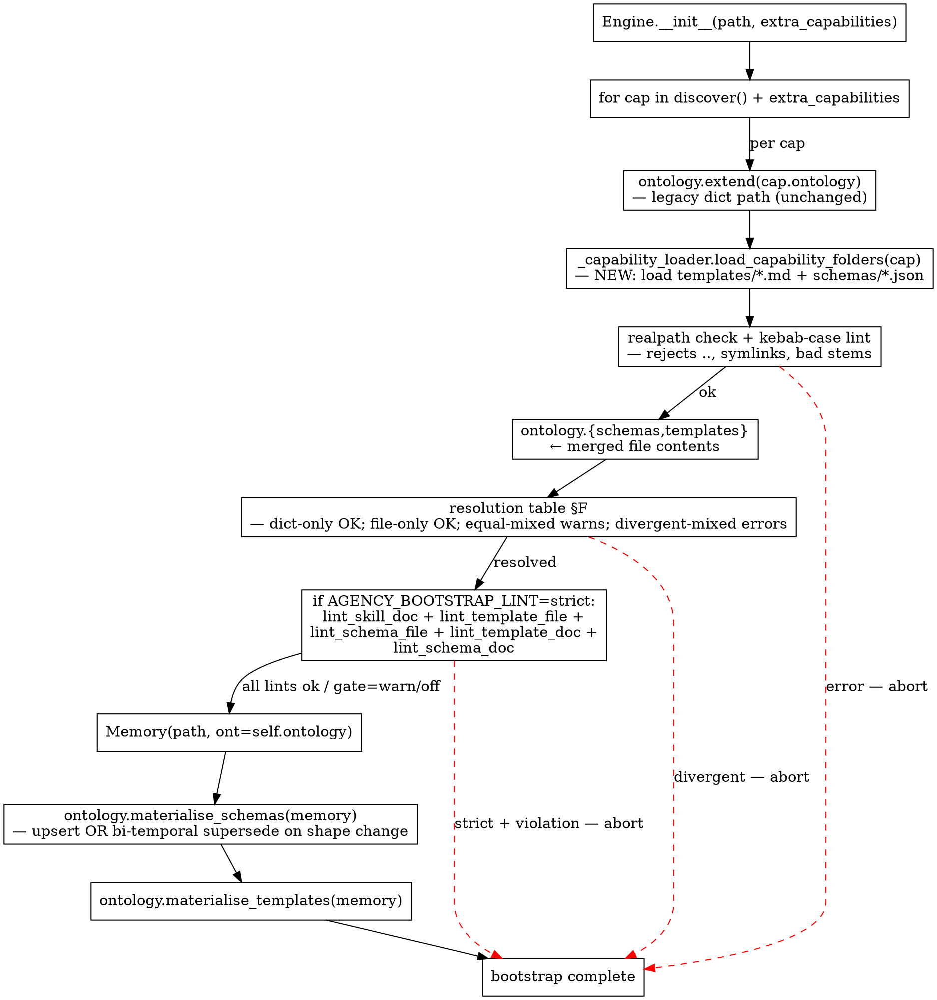

# Spec 032 — Templates & Schemas as OOP Capability Extensions

## Why

After Spec 031 (skills as `SkillDoc` + `WalkerSkills` dataclasses on `CapabilityBase`), the OntologyExtension still carries **schemas** and **templates** as raw `dict[str, Any]` fields. Two structural consequences:

1. Schemas declared via `OntologyExtension.schemas` populate an in-memory registry but no `Schema` nodes ever land in the graph — `Memory.validate_schema` (`agency/memory.py:144`) is test-proven but production-unwired. This is exactly Spec 004's "registry without enforcement" gap.
2. Templates declared via `OntologyExtension.templates` (or as Python `Template` constants in `agency/templates.py`) have no consistent location. A capability author writing template content edits Python source — friendlier formats (markdown, plain text) require ceremony.

The user-directed solution is structural symmetry across the three first-class ontology contributions:

| Concern | Today | Spec 031 | Spec 032 |
|---|---|---|---|
| skills | `OntologyExtension.skills` raw dict | `WalkerSkills` dataclass + `SkillDoc` metadata | (unchanged from 031) |
| schemas | `OntologyExtension.schemas` raw dict | — | `ArtefactSchemas` dataclass + `SchemaDoc` metadata; files in `agency/capabilities/<cap>/schemas/*.json`; materialised to `Schema` nodes |
| templates | `OntologyExtension.templates` raw dict OR Python `Template` constants | — | `RenderTemplates` dataclass + `TemplateDoc` metadata; files in `agency/capabilities/<cap>/templates/*.md\|.tpl\|.sh`; materialised to `Template` nodes |

Plus a parallel structural change for engine-owned templates:
- Move the Spec 031 Task 1.4 Python `Template` constants (`CAPABILITY_SKILL_MD`, `VERB_REFERENCE_MD`, `BASH_WRAPPER_SH`, `HELP_INDEX_MD`) to files in `agency/render/` (panel F-1: folder named `render` to avoid colliding with the existing `agency/templates.py` helpers module).
- `agency/templates.py` STAYS as the helpers module (`manifest_obj`, `marketplace_obj`, `_yaml_scalar`) — only the Template constants are extracted to files.
- Spec 004's `materialise_schemas` pass is FOLDED into this spec (panel agreement — `supersedes: ["004"]`).

The combined effect: a capability author works in one folder; templates and schemas are editable as files (no Python ceremony); the engine materialises Schema/Template nodes so `Memory.validate_schema` finally has production targets; backwards-compat preserved for legacy dict-based capabilities.

## Done When

### A. Dataclass core extension

- [ ] `agency/capability.py` ships four new dataclasses (parallel to `SkillDoc` / `WalkerSkills`):
  ```python
  @dataclass
  class TemplateDoc:
      description: str                # "Use when..." — for the SKILL.md ## Templates row
      canonical_example: str

  @dataclass
  class SchemaDoc:
      description: str
      canonical_example: str

  @dataclass
  class RenderTemplates:
      folder: Path
      docs: dict[str, TemplateDoc] = field(default_factory=dict)   # F-8: keyed by filename stem
      @classmethod
      def from_module(cls, module_file: str, subfolder: str = "templates",
                      docs: dict[str, TemplateDoc] | None = None) -> "RenderTemplates":
          """Resolve folder relative to a capability module's __file__.
          Hides Path(__file__).parent boilerplate (panel F-7)."""

  @dataclass
  class ArtefactSchemas:
      folder: Path
      docs: dict[str, SchemaDoc] = field(default_factory=dict)
      @classmethod
      def from_module(cls, module_file: str, subfolder: str = "schemas",
                      docs: dict[str, SchemaDoc] | None = None) -> "ArtefactSchemas":
          """Same pattern as RenderTemplates.from_module."""
  ```
- [ ] `CapabilityBase` gains two `ClassVar` attributes mirroring Spec 031's pattern:
  ```python
  render_templates: ClassVar[Optional[RenderTemplates]] = None
  artefact_schemas: ClassVar[Optional[ArtefactSchemas]] = None
  ```

### B. File loader (`agency/_capability_loader.py`)

- [ ] New module exposes `load_capability_folders(cap) → tuple[dict, dict]` returning `(templates, schemas)` to merge into the effective ontology.
- [ ] Discovers files matching `*.md|*.tpl|*.sh` under `cap.render_templates.folder` and `*.json` under `cap.artefact_schemas.folder`.
- [ ] **Path safety (F-9):** every loaded path goes through `os.path.realpath`; the resolved path MUST `startswith(os.path.realpath(cap_folder))`. Rejects `..` traversal AND symlinks escaping the capability folder.
- [ ] **Kebab-case filename rule:** filename stem MUST match `^[a-z0-9]+(-[a-z0-9]+)*$`.
- [ ] **Empty-folder rule (F-11):** declaring `RenderTemplates(folder=X)` with zero matching files raises a bootstrap error — declared the contract but didn't fulfill it. The "no templates" case is `render_templates = None` (the default).

### C. Schema-shape detection (F-3)

- [ ] Schema file shape detection at load:
  - Simple shape: top-level dict with `"required": ["..."]` and no `"$schema"` key → keeps the current `templates.REQUIRED` contract.
  - Draft-07 shape: top-level dict with `"$schema"` key → loaded as-is for downstream `validate_schema_draft07`.
- [ ] **Two `Memory` methods (panel F-3 resolution):**
  - `validate_schema(node_id, schema_id)` — UNCHANGED contract. Reads `Schema.required` CSV. Fast path. Works for both shapes (uses only the `required` field of the schema node).
  - `validate_schema_draft07(node_id, schema_id)` — NEW. Reads `Schema.schema_json`; runs `jsonschema.Draft7Validator(json.loads(schema_json))` against the node's recalled props. Raises `RuntimeError("schema {id!r} is not draft-07")` if `schema_json` field is absent.

### D. Materialiser (rolled in from Spec 004)

- [ ] `agency/ontology.py` ships two new methods (and the Spec 004 mode parameter folded in here):
  ```python
  def materialise_schemas(self, memory: Memory) -> dict[str, str]:
      """Record one Schema node per ontology.schemas entry. Returns {name: node_id}.
      Idempotent on re-run via deterministic id `schema:<name>`.
      Bi-temporal supersede on shape change (panel F-4):
        - if a node already exists at `schema:<name>` AND its `required`/`schema_json` differs from new content → emit a NEW version via memory.supersede + SUPERSEDED_BY edge
        - if identical → no-op
        - if absent → fresh record"""

  def materialise_templates(self, memory: Memory) -> dict[str, str]:
      """Same semantics for Template nodes (id `template:<name>`).
      Body diff triggers supersede; identical body is a no-op."""
  ```
- [ ] **Bi-temporal supersede on shape change (F-4):** when a schema file's shape changes (e.g., simple → draft-07, or `required` list grows/shrinks), the materialiser emits a new `Schema` node version with `SUPERSEDED_BY` edge from the previous version. `Memory.recall("schema:<name>")` returns the LATEST version; as-of queries see history.
- [ ] **Retroactive coverage (Spec 004 rolled in):** materialiser runs for ALL `ontology.schemas` entries — including the 5 legacy plugin kinds (`plugin-manifest`, `skill-md`, `command-md`, `marketplace-entry`, `step-doc`). They get `Schema` nodes even though they came in via the legacy `OntologyExtension.schemas` dict path. Spec 004's `delegate.join` + `jules.dispatch` `VALIDATES_AGAINST` edges work the same way.

### E. Engine bootstrap pipeline

- [ ] `Engine.__init__` calls `_capability_loader.load_capability_folders(cap)` for every registered capability AFTER `ontology.extend(cap.ontology)` AND BEFORE the existing Spec 031 skill_doc validation block.
- [ ] After `Memory(path, ont=self.ontology)` is constructed:
  ```python
  self._schema_node_ids = self.ontology.materialise_schemas(self.memory)
  self._template_node_ids = self.ontology.materialise_templates(self.memory)
  ```
- [ ] **Generalized lint gate (F-10):** replaces Spec 031's `AGENCY_SKILL_DOC_REQUIRED` with `AGENCY_BOOTSTRAP_LINT ∈ {strict, warn, off}` (default `off` for Phase 1 transition; flipped to `strict` in Phase 5). All bootstrap lint families (skill_doc, template_file, schema_file, template_doc, schema_doc) honor the same flag.

### F. Backwards-compat resolution table (F-2)

- [ ] Spec the precise behavior at `_capability_loader.load_capability_folders`:

| `cap.ontology.{schemas,templates}` declared | folder file exists | resolution |
|---|---|---|
| Yes (key=X, value=V_dict) | No file for X | Dict wins; no warning (legacy mode). |
| No | Yes (file X with content V_file) | File wins; no warning (new mode). |
| Yes (key=X, value=V_dict) | Yes (file X with content V_file), `V_dict == V_file` | DeprecationWarning naming the cap + name; file wins. |
| Yes (key=X, value=V_dict) | Yes (file X with content V_file), `V_dict != V_file` | **InstallError**: divergent declarations. Author MUST pick one source. |

- [ ] **Sunset policy:** in v2 (Spec 04x) the `OntologyExtension.{schemas,templates}` fields are removed. Document the deprecation timeline in `OntologyExtension.__doc__`.

### G. Generated SKILL.md sections (Spec 031 §6 extension)

- [ ] `CAPABILITY_SKILL_MD` template (now living at `agency/render/capability-skill.md` per F-1) gains two new sections:
  ```markdown
  ## Schemas

  $schemas_table

  ## Templates

  $templates_table
  ```
- [ ] Each row links to the file: `| reflection | Use when ... | [details](schemas/reflection.json) |`.
- [ ] Empty when capability ships none (`(none)` row).

### H. agency/render/ folder population

- [ ] Move the Spec 031 Task 1.4 Python Template constants to files (panel F-1 coordination — Spec 031 Task 1.4 is REVERTED so Spec 032 lands these as files directly, avoiding the 031→032 churn):
  - `agency/render/capability-skill.md` ← was `CAPABILITY_SKILL_MD`
  - `agency/render/verb-reference.md` ← was `VERB_REFERENCE_MD`
  - `agency/render/bash-wrapper.sh` ← was `BASH_WRAPPER_SH`
  - `agency/render/help-index.md` ← was `HELP_INDEX_MD`
- [ ] Move historic `templates.py` constants to files:
  - `agency/render/skill-md.tpl` ← was `SKILL_MD`
  - `agency/render/command-md.tpl` ← was `COMMAND_MD`
  - `agency/render/step-doc.md` ← was `STEP_DOC`
- [ ] `agency/install.py` updated to load templates from `agency/render/` via the same loader. Calls `string.Template(path.read_text())` once at import time.

### I. Capability migrations (worked examples §7)

Each migration follows the **F-6 5-step recipe**:
1. Create `schemas/` (or `templates/`) folder under the capability.
2. Move dict entries to files (one per key, kebab-case stem).
3. Replace `OntologyExtension(schemas={...})` with `artefact_schemas = ArtefactSchemas.from_module(__file__, "schemas", docs={"name": SchemaDoc(...)})`.
4. Run bootstrap with `AGENCY_BOOTSTRAP_LINT=strict` — verify pass.
5. Remove the old `OntologyExtension.schemas` assignment.

Capabilities to migrate in this spec:
- [ ] **reflect** (worked example proof — Spec 031 §21 reference shape). Folder migration (mini-Spec-028) + `templates/reflection-note.md` + `schemas/reflection.json`.
- [ ] **jules** (Spec 004 `jules-session` target). Folder migration + `schemas/jules-session.json`. Add `mem.link(artefact_id, "schema:jules-session", "VALIDATES_AGAINST")` in `jules.dispatch` (Spec 004's verb-side wiring).
- [ ] **delegate** (Spec 004 `reduction` target). `schemas/reduction.json`. `delegate.join` records full reduction artefact + VALIDATES_AGAINST.
- [ ] **plugin** (5 historic kinds). Folder migration + 5 schemas in `schemas/`.

### J. Tests

- [ ] `tests/test_capability_loader.py` — file discovery for both folders; path-safety unit tests (`..` rejection, symlink rejection); kebab-case rule; empty-folder rule.
- [ ] `tests/test_materialiser.py` — Schema node recorded per entry; Template node recorded per entry; idempotent re-run; bi-temporal supersede on shape change (the F-4 Gherkin scenario); retroactive coverage of the 5 legacy plugin kinds.
- [ ] `tests/test_mixed_mode_compat.py` — the 4-row resolution table from §F (dict-only, file-only, equal-mixed, divergent-mixed-error).
- [ ] `tests/test_path_safety.py` — explicit symlink-escape rejection test (creates a symlink in a tmp capability folder pointing at `/etc/passwd`, expects InstallError).
- [ ] **Extended TEST-2 from Spec 031 (F-15):** subagent reads `skills/reflect/SKILL.md` + `schemas/reflection.json` + `templates/reflection-note.md`, constructs a `ctx.render` call followed by a `validate_schema` round-trip, WITHOUT source reads. Pass iff both succeed.

## Component map (Spec 032)



## Bootstrap sequence (Spec 032)



## File layout

**Per-capability folder** (mirrors Spec 031 §1, extended):

```
agency/capabilities/<cap>/
  __init__.py              # re-exports the capability class
  _main.py                 # CapabilityBase subclass — declares skill_doc + walker_skills
                           #   (Spec 031) + render_templates + artefact_schemas (Spec 032)
  templates/               # capability-owned template files (Spec 032)
    <name>.md
    <name>.tpl
    <name>.sh
  schemas/                 # capability-owned schema files (Spec 032)
    <name>.json
  references/              # per-verb reference files (Spec 031)
    <verb>.md
```

**Core engine folder:**

```
agency/
  render/                              # NEW (per panel F-1 — name chosen to avoid templates.py collision)
    __init__.py                        # empty marker
    capability-skill.md                # was: Spec 031 Task 1.4 CAPABILITY_SKILL_MD constant
    verb-reference.md                  # was: VERB_REFERENCE_MD
    bash-wrapper.sh                    # was: BASH_WRAPPER_SH
    help-index.md                      # was: HELP_INDEX_MD
    skill-md.tpl                       # was: SKILL_MD (existing in templates.py)
    command-md.tpl                     # was: COMMAND_MD
    step-doc.md                        # was: STEP_DOC
  templates.py                         # KEPT — but only as helpers module:
                                       #   manifest_obj, marketplace_obj, _yaml_scalar
                                       #   (Template constants removed; they're files now)
  _capability_loader.py                # NEW — load + lint + path-safety for cap folders
```

## Worked example: reflect migration recipe (F-6)

### Step 1: Create folder structure

```
agency/capabilities/reflect/
  __init__.py
  _main.py        # was: agency/capabilities/reflect.py
  templates/
    reflection-note.md
  schemas/
    reflection.json
```

### Step 2: Move dict entries to files

`agency/capabilities/reflect/templates/reflection-note.md`:
```markdown
# $scope

$text
```

`agency/capabilities/reflect/schemas/reflection.json`:
```json
{"required": ["scope", "text"]}
```

### Step 3: Replace OntologyExtension dict declarations

```python
from pathlib import Path
from ..capability import (CapabilityBase, verb, SkillDoc, WalkerSkills,
                          RenderTemplates, ArtefactSchemas, TemplateDoc, SchemaDoc)


class ReflectCapability(CapabilityBase):
    name = "reflect"
    home = "memory"
    ontology = OntologyExtension(
        nodes={"Reflection": ["scope", "text"]},
        enums={("Reflection", "scope"): REFLECT_SCOPES},
        edges={"OBSERVED_DURING", "INFORMS"},
        # NOTE: schemas / templates removed from here — they're declared below
    )
    skill_doc = SkillDoc(...)  # Spec 031 §21
    walker_skills = WalkerSkills(schemas={})

    render_templates = RenderTemplates.from_module(
        __file__, "templates",
        docs={"reflection-note": TemplateDoc(
            description="Use when rendering a Reflection as a human-readable markdown note.",
            canonical_example="ctx.render('reflection-note', scope='observation', text='X → Y')",
        )},
    )

    artefact_schemas = ArtefactSchemas.from_module(
        __file__, "schemas",
        docs={"reflection": SchemaDoc(
            description="Use when validating a Reflection node has all required fields.",
            canonical_example="memory.validate_schema(node_id, 'schema:reflection')",
        )},
    )
```

### Step 4: Verify bootstrap

```bash
AGENCY_BOOTSTRAP_LINT=strict python -c "from agency.engine import Engine; Engine(':memory:')"
```
Expected: no error, Schema node `schema:reflection` and Template node `template:reflection-note` are recorded.

### Step 5: Confirm no legacy fields remain

```bash
grep -E "schemas\s*=\s*\{" agency/capabilities/reflect/_main.py
```
Expected: zero matches.

## Open Questions

- **OQ-1 (RESOLVED 2026-05-31 — panel F-1).** Migration path templates.py → folder. Resolution: keep `agency/templates.py` as helpers-only module; introduce `agency/render/` for template FILES (different name avoids collision). Spec 031 Task 1.4 Python Template constants are NOT landed (REVERT pending) — they go straight to files in Spec 032.
- **OQ-2 (RESOLVED 2026-05-31 — panel F-2).** Mixed-mode resolution: 4-row table; divergent = hard InstallError, not warning.
- **OQ-3 (RESOLVED 2026-05-31 — panel F-3).** Schema validation: two `Memory` methods (`validate_schema` simple, `validate_schema_draft07` strict), not one with internal dispatch.
- **OQ-4 (RESOLVED 2026-05-31 — panel F-4).** Materialiser idempotency: bi-temporal supersede on shape change, not destructive upsert.
- **OQ-5 (RESOLVED 2026-05-31 — panel F-9).** Path safety: `..` rejection AND symlink rejection via `os.path.realpath`. Applies to both per-cap and core `agency/render/` folders.
- **OQ-6 (DEFERRED — panel F-5).** `Linter` Protocol extraction for bootstrap lint families. YAGNI for 2 families (skill_doc, template+schema_file). Revisit when a 3rd family appears.
- **OQ-7 (DEFERRED — panel F-13).** `DERIVED_FROM` edge for `ctx.render → Artefact` provenance. Optional add-on; doesn't block this spec.
- **OQ-8 (DEFERRED — panel F-15).** Extended TEST-2 covering `ctx.render` + `validate_schema` round-trip. Documented in §J; implementer expands per writing-plans.

## Evidence

- Spec 031 §13 — `SkillDoc` + `WalkerSkills` parallel pattern (shipped Task 1.1+1.2).
- Spec 004 — schema materialiser doctrine (now folded in here; `supersedes: ["004"]`).
- Spec 020 — `.agency/session.db` central graph; Schema/Template nodes get committed via the same path.
- `agency/ontology.py:25-26` — existing `Schema` + `Template` node schemas (no new node types needed).
- `agency/ontology.py:43` — `VALIDATES_AGAINST` edge already in EDGE_TYPES.
- `agency/memory.py:144-153` — `validate_schema` reads `Schema.required` CSV. Today's contract preserved.
- Spec-panel critique 2026-05-31 — 15 findings; 5 immediate folded inline above; 5 short-term carried as design notes; 4 long-term tracked as Open Questions OQ-6/7/8.

## Non-goals

- **Removing `OntologyExtension.{schemas,templates}` fields.** v1 keeps them as merge target for backwards-compat. v2 (Spec 04x) removes after a full sunset cycle.
- **Promoting `Schema`/`Template` to first-class concept on par with Intent/Capability/Lifecycle/Memory.** They remain node types managed by the substrate, not new concepts (`docs/vision/CORE.md` doctrine).
- **Touching the engine MCP wire surface.** No new `search`/`get_schema`/`execute` behavior changes.
- **`Linter` Protocol abstraction.** Deferred (OQ-6).
- **`DERIVED_FROM` provenance edge wiring.** Deferred (OQ-7).

## Followup — Superseded by Spec 060 (2026-06-03)

**Verdict:** ~70% shipped (the substrate). Remaining ~30% (bootstrap
wire-up, per-capability migrations, agent-instruction doctrine, lint
rule) carries over to **Spec 060 — Templates & Schemas: Bootstrap,
Migration, Agent-Instruction Doctrine**.

This Followup is the supersede marker. Spec 032's text stays verbatim
faithful to its original design moment; the doctrinal evolution lives
in the graph-of-specs as a supersede edge (GOALS.md #7 pattern, same
shape as Spec 001 → Spec 019 supersede).

### What Spec 032 SHIPPED (preserved in 060 as foundation)
- `agency/capability.py:147-225` — `TemplateDoc`, `SchemaDoc`,
  `RenderTemplates`, `ArtefactSchemas` dataclasses + ClassVars on
  `CapabilityBase`.
- `agency/_capability_loader.py` — `load_capability_folders` +
  path-safe resolution (`_safe_resolve` rejects `..` + symlink
  escapes). Kebab-case filename rule. Extension whitelist.
- `agency/ontology.py:195/229` — `materialise_schemas` +
  `materialise_templates` with bi-temporal supersede on shape change.
- `agency/memory.py::validate_schema_draft07` — jsonschema-based
  validation alongside the simple `validate_schema`.
- `agency/render/` folder populated with 7 engine-owned templates
  (Spec 031 contribution, used by `skill_emit.py`).
- `agency/templates.py` reduced to 109 LOC — bodies load from
  `agency/render/`; only `REQUIRED` + helpers remain.
- Backwards-compat resolution table (F-2).

### What CARRIES OVER to Spec 060
- **Bootstrap wire-up** — `Engine.__init__` calls
  `load_capability_folders` for every cap (today: the loader is
  imported only by tests; production never invokes it).
- **Per-capability folder migration roster** — `dogfood`, `reflect`,
  `delegate`, `branch`, `workspace`, `gate`, `subagent`,
  `skill_generator`, `develop`, `plugin`, `jules` (absorbs Spec 028).
- **Per-capability template + schema files** — none exist today; 060
  ships the full roster (15+ files across 10+ caps).
- **Agent-instruction doctrine** — new convention adapted from
  Bitwize-music plugin: `<!-- AGENT: ... -->` HTML-comment
  instructions, `<!-- BEGIN IF / END IF -->` conditional sections,
  chain-next instruction-block at template tail.
- **`plugin._check_template_folder` lint rule** — folder existence,
  kebab-case, instruction-block presence. Seventh rule under the
  Spec 016 scaffold.
- **Verb migration to `ctx.template(name)`** — flip every
  Python-string-concat rendering site to file-based.

### Spec 028 absorbed into 060
Spec 028 (jules-folder-migration) folds into 060's heavy-migration
wave. `jules/` becomes `agency/capabilities/jules/{_main.py, api.py,
watch.py, patch.py, preambles.py, skills.py, reference.md,
templates/, schemas/}`.
