# Workflow — Spec 031 (Skills) + Spec 032 (Templates & Schemas) Implementation

> **Generated:** 2026-05-31 via `/sc:sc-workflow`
> **Scope:** ~22 remaining tasks across two specs, dispatched via subagent-driven-development
> **Baseline:** branch `claude/friendly-faraday-5StIK` at commit `e79645c` — 354 tests passing
> **Constraint:** each task is TDD (RED → GREEN → commit), one implementer per task,
> spec + code-quality reviewers after each, pushes between phases.

---

## ⚠️ BLOCKER — `agency/render/` folder name collides with existing `agency/render.py`

The Spec 032 Task 1.2 implementer reported **BLOCKED**: the planned folder `agency/render/` cannot coexist with the existing `agency/render.py` module (Spec 023 Phase 1 — `parse_slices`, `render_verb`, `render_phase`, `_first_sentence`). 8 import sites depend on `from agency.render import …`. Python directory packages shadow sibling `.py` files of the same name.

### Resolution options (USER CHECKPOINT — pause for decision)

| Option | Description | Cost | Risk |
|---|---|---|---|
| **(1) Rename existing module** | `agency/render.py` → `agency/disclosure.py`; update 8 import sites in one prep commit; proceed with Spec 032 Task 1.2 as written. | Small (1 rename + 8 import updates) | Low — `disclosure.py` describes the renderer's purpose better (Spec 023's "Adaptive disclosure" verb). |
| **(2) Rename new folder** | `agency/render/` → `agency/template_files/` (or `render_files/`, `skeletons/`); update Spec 032 docs to match; downstream Task 1.3 loader + install.py changes need re-resolving. | Medium (update spec + plan + downstream tasks) | Medium — splits "render" vocabulary that Spec 032 uses across `ctx.render`, `RenderTemplates`, etc. |
| **(3) Reuse render.py as package** | Convert `agency/render.py` → `agency/render/__init__.py` (re-exports `parse_slices` etc. from `render/_disclosure.py`); template files go alongside as `render/*.md`. | Small (re-arrange + re-export) | Medium — mixes code submodule + template data files in one package; semantically muddier. |

**Recommendation:** **Option 1** (rename existing). `disclosure.py` is a stronger name for the adaptive-disclosure renderer (the verb `disclose` matches the function), and Spec 032's "render" vocabulary maps cleanly to template-related concepts. The rename is mechanical and reversible.

**This is the first task in the workflow below — TASK A0.**

---

## Workflow phase map

```dot
digraph workflow {
    rankdir=TB;
    node [shape=box];

    A0 [label="A0: Resolve render/ collision\n(rename agency/render.py → disclosure.py)\nUSER CHECKPOINT", style=filled, fillcolor=lightyellow];

    subgraph cluster_31_followup {
        label="Spec 031 Task 1.3 follow-up";
        FU1 [label="FU.1: add 2 missing negative tests\n(overview-no-workflow-summary,\nred-flags-format)"];
        FU2 [label="FU.2: type doc: SkillDoc + v: list[dict]"];
    }

    subgraph cluster_032_phase1 {
        label="Spec 032 Phase 1 finish";
        T1_2 [label="1.2: agency/render/ + 7 template files\n(was BLOCKED — unblocked by A0)"];
        T1_3 [label="1.3: agency/_capability_loader.py\n(path-safe loader)"];
        T1_4 [label="1.4: tests/test_path_safety.py\n(.. + symlink rejection)"];
    }

    CHECK1 [label="CHECKPOINT 1: Phase 1 complete\nUser review before Phase 2", style=filled, fillcolor=lightyellow];

    subgraph cluster_032_phase2 {
        label="Spec 032 Phase 2 — Materialiser";
        T2_1 [label="2.1: Memory.validate_schema_draft07"];
        T2_2 [label="2.2: Ontology.materialise_schemas/templates\n(bi-temporal supersede on shape change)"];
        T2_3 [label="2.3: retroactive coverage of 5 legacy plugin kinds"];
    }

    subgraph cluster_031_phase2 {
        label="Spec 031 Phase 2 — Pipeline";
        T31_2_1 [label="31-2.1: skill_emit.emit_skill"];
        T31_2_2 [label="31-2.2: emit_references"];
        T31_2_3 [label="31-2.3: emit_bash_wrappers"];
        T31_2_4 [label="31-2.4: cache.py atomic"];
        T31_2_5 [label="31-2.5: install.generate per-cap delegation\n+ --dry-run + chmod fallback"];
    }

    CHECK2 [label="CHECKPOINT 2: pipelines integrated\nUser review", style=filled, fillcolor=lightyellow];

    subgraph cluster_032_phase3 {
        label="Spec 032 Phase 3 — Engine integration";
        T32_3_1 [label="32-3.1: Engine.__init__ extension\n(load folders + materialiser calls)"];
        T32_3_2 [label="32-3.2: mixed-mode resolution table"];
        T32_3_3 [label="32-3.3: AGENCY_BOOTSTRAP_LINT unified env"];
    }

    subgraph cluster_031_phase3 {
        label="Spec 031 Phase 3 — Wire surface";
        T31_3_1 [label="31-3.1: skill_list substrate"];
        T31_3_2 [label="31-3.2: skill capability folder\n(current/submit/done verbs)"];
        T31_3_3 [label="31-3.3: _walker.py state recovery"];
        T31_3_4 [label="31-3.4: SkillCapability.skill_doc\n(dogfood)"];
    }

    CHECK3 [label="CHECKPOINT 3: wire surface live\nUser review", style=filled, fillcolor=lightyellow];

    subgraph cluster_031_phase4 {
        label="Spec 031 Phase 4 — Migrate 11 caps";
        T31_4_1 [label="31-4.1: reflect.skill_doc\n(worked example proof)"];
        T31_4_2 [label="31-4.2: 6 trivial caps\n(branch/workspace/dogfood/gate/\nskill_generator/subagent)"];
        T31_4_3 [label="31-4.3: develop + walker_skills"];
        T31_4_4 [label="31-4.4: plugin + walker_skills"];
        T31_4_5 [label="31-4.5: delegate + jules"];
    }

    subgraph cluster_032_phase4 {
        label="Spec 032 Phase 4 — Migrate caps to files";
        T32_4_1 [label="32-4.1: reflect schemas+templates"];
        T32_4_2 [label="32-4.2: jules schemas (Spec 004 jules-session)"];
        T32_4_3 [label="32-4.3: delegate schemas (Spec 004 reduction)"];
        T32_4_4 [label="32-4.4: plugin (5 historic kinds → files)"];
    }

    CHECK4 [label="CHECKPOINT 4: all migrations complete\nshim removable", style=filled, fillcolor=lightyellow];

    subgraph cluster_phase5 {
        label="Phase 5 — Cleanup + Discipline + PRs";
        T31_5_1 [label="31-5.1: rm hand-authored skills/"];
        T31_5_2 [label="31-5.2: regenerate skills/ + bin/"];
        T31_5_3 [label="31-5.3: TEST-2 e2e discipline test"];
        T32_5_1 [label="32-5.1: SKILL.md Templates/Schemas sections"];
        T32_5_2 [label="32-5.2: extended TEST-2 (F-15)"];
        T32_5_3 [label="32-5.3: sunset doc"];
        T_PR [label="PR + status flip on both specs"];
    }

    DONE [label="GOAL COMPLETE", style=filled, fillcolor=lightgreen];

    A0 -> FU1;
    A0 -> T1_2;
    FU1 -> FU2;
    T1_2 -> T1_3;
    T1_3 -> T1_4;
    T1_4 -> CHECK1;
    FU2 -> CHECK1;
    CHECK1 -> T2_1;
    CHECK1 -> T31_2_1;
    T2_1 -> T2_2;
    T2_2 -> T2_3;
    T31_2_1 -> T31_2_2;
    T31_2_2 -> T31_2_3;
    T31_2_3 -> T31_2_4;
    T31_2_4 -> T31_2_5;
    T2_3 -> CHECK2;
    T31_2_5 -> CHECK2;
    CHECK2 -> T32_3_1;
    T32_3_1 -> T32_3_2;
    T32_3_2 -> T32_3_3;
    T32_3_3 -> T31_3_1;
    T31_3_1 -> T31_3_2;
    T31_3_2 -> T31_3_3;
    T31_3_3 -> T31_3_4;
    T31_3_4 -> CHECK3;
    CHECK3 -> T31_4_1;
    CHECK3 -> T32_4_1;
    T31_4_1 -> T31_4_2;
    T31_4_2 -> T31_4_3;
    T31_4_3 -> T31_4_4;
    T31_4_4 -> T31_4_5;
    T32_4_1 -> T32_4_2;
    T32_4_2 -> T32_4_3;
    T32_4_3 -> T32_4_4;
    T31_4_5 -> CHECK4;
    T32_4_4 -> CHECK4;
    CHECK4 -> T31_5_1;
    CHECK4 -> T32_5_1;
    T31_5_1 -> T31_5_2;
    T31_5_2 -> T31_5_3;
    T32_5_1 -> T32_5_2;
    T32_5_2 -> T32_5_3;
    T31_5_3 -> T_PR;
    T32_5_3 -> T_PR;
    T_PR -> DONE;
}
```

---

## Phase / task table

### Pre-flight: BLOCKER resolution

| ID | Task | Files | Sequential? | Reviewer pair? | Est. commits |
|---|---|---|---|---|---|
| **A0** | Resolve `agency/render/` collision | depends on user decision (rename `render.py` → `disclosure.py` if Option 1) | **USER CHECKPOINT** | optional | 1 |

### Spec 031 Task 1.3 follow-up (parallel-safe with A0)

| ID | Task | Files | Parallel-safe? | Reviewer pair? |
|---|---|---|---|---|
| FU.1 | Add 2 missing negative tests (`overview-no-workflow-summary`, `red-flags-format`) | `tests/test_skill_doc_validation.py` | ✅ parallel with A0 (different files) | yes |
| FU.2 | Type `doc: SkillDoc` + `v: list[dict]` in `lint_skill_doc` | `agency/capabilities/plugin.py` | sequential after FU.1 (same file region as 1.3) | spec only (no behavior change) |

### Spec 032 Phase 1 finish (after A0)

| ID | Task | Files | Sequential? | Notes |
|---|---|---|---|---|
| 32-1.2 | `agency/render/` + 7 template files | new folder + 7 files + `templates.py` re-exports + `tests/test_render_folder.py` | sequential after A0 | Was BLOCKED — A0 unblocks. |
| 32-1.3 | `agency/_capability_loader.py` (path-safe) | new file + tests | sequential after 32-1.2 | Loader uses new dataclasses from Task 1.1. |
| 32-1.4 | `tests/test_path_safety.py` (.. + symlink rejection) | new file | sequential after 32-1.3 | Validates path safety in loader. |

**→ CHECKPOINT 1: User review (Phase 1 complete — foundation infrastructure)**

### Phase 2 — Materialiser + Emit pipeline (parallel tracks)

Track A: Spec 032 materialiser
| ID | Task | Files | Notes |
|---|---|---|---|
| 32-2.1 | `Memory.validate_schema_draft07` | `agency/memory.py` + test | Sequential. |
| 32-2.2 | `Ontology.materialise_schemas/templates` (bi-temporal supersede) | `agency/ontology.py` + `tests/test_materialiser.py` | Sequential after 32-2.1. |
| 32-2.3 | Retroactive coverage of 5 legacy plugin kinds | extend `tests/test_materialiser.py` | Sequential after 32-2.2. |

Track B: Spec 031 emit pipeline (PARALLEL-SAFE with Track A — different files)
| ID | Task | Files | Notes |
|---|---|---|---|
| 31-2.1 | `skill_emit.emit_skill` | `agency/skill_emit.py` + test | Sequential. |
| 31-2.2 | `emit_references` | extend `skill_emit.py` + tests | Sequential after 31-2.1. |
| 31-2.3 | `emit_bash_wrappers` | extend `skill_emit.py` + tests | Sequential after 31-2.2. |
| 31-2.4 | `agency/cache.py` (atomic write) | new file + `tests/test_skill_cache_atomic.py` | Sequential after 31-2.3. |
| 31-2.5 | `install.generate` per-cap delegation + `--dry-run` + chmod fallback | `agency/install.py` + tests | Sequential after 31-2.4. |

**→ CHECKPOINT 2: User review (pipelines built; engine integration next)**

### Phase 3 — Engine integration (sequential — SAME engine.py file)

| ID | Task | Files | Notes |
|---|---|---|---|
| 32-3.1 | Engine bootstrap extension (load folders + materialiser calls) | `agency/engine.py` + tests | Sequential. |
| 32-3.2 | Mixed-mode resolution table (4 rows) | extend `_capability_loader.py` + `tests/test_mixed_mode_compat.py` | Sequential after 32-3.1. |
| 32-3.3 | `AGENCY_BOOTSTRAP_LINT` unified env (deprecate `AGENCY_SKILL_DOC_REQUIRED`) | `agency/engine.py` + update existing Spec 031 tests | Sequential after 32-3.2. |
| 31-3.1 | `skill_list` substrate tool | `agency/engine.py` + `tests/test_skill_mcp_surface.py` | Sequential after 32-3.3. |
| 31-3.2 | `skill` capability folder + verbs | new `agency/capabilities/skill/{__init__,_main,_walker}.py` + tests | Sequential after 31-3.1. |
| 31-3.3 | `_walker.py` state recovery from graph | inside 31-3.2 | folded in. |
| 31-3.4 | `SkillCapability.skill_doc` (dogfood) | extend `skill/_main.py` | Sequential after 31-3.2. |

**→ CHECKPOINT 3: User review (wire surface live; migrations next)**

### Phase 4 — Capability migrations (PARALLEL-SAFE per capability — different files)

Track A: Spec 031 SkillDoc migration (11 capabilities)
| ID | Task | Files | Notes |
|---|---|---|---|
| 31-4.1 | reflect.skill_doc (worked example) | `agency/capabilities/reflect.py` (or folder if migrated) | Sequential first. |
| 31-4.2 | 6 trivial caps (branch/workspace/dogfood/gate/skill_generator/subagent) | 6 files | **Parallel-safe** — one subagent per cap. |
| 31-4.3 | develop + walker_skills (lift DEV_SKILLS) | `agency/capabilities/develop.py` | Sequential. |
| 31-4.4 | plugin + walker_skills | `agency/capabilities/plugin.py` | Sequential after 31-4.3 (same lint module). |
| 31-4.5 | delegate + jules | 2 files | Sequential after 31-4.4. |

Track B: Spec 032 file migration (PARALLEL with Track A — different cap files OR mergeable per cap)
| ID | Task | Files | Notes |
|---|---|---|---|
| 32-4.1 | reflect schemas+templates folders | `agency/capabilities/reflect/{templates,schemas}/*` | **MERGE with 31-4.1** — one PR adds both skill_doc AND folders for reflect. |
| 32-4.2 | jules schemas (Spec 004 jules-session) | `agency/capabilities/jules/schemas/jules-session.json` + dispatch verb update | **MERGE with 31-4.5** for jules. |
| 32-4.3 | delegate schemas (Spec 004 reduction) | `agency/capabilities/delegate/schemas/reduction.json` + join verb update | **MERGE with 31-4.5** for delegate. |
| 32-4.4 | plugin 5 historic kinds → files | `agency/capabilities/plugin/schemas/{plugin-manifest,skill-md,command-md,marketplace-entry,step-doc}.json` | **MERGE with 31-4.4** for plugin. |

**→ CHECKPOINT 4: User review (all 11 caps migrated; shim removable)**

### Phase 5 — Cleanup + Discipline + PRs (parallel-safe)

| ID | Task | Files | Notes |
|---|---|---|---|
| 31-5.1 | rm hand-authored `skills/` files | git rm | Cleanup. |
| 31-5.2 | regenerate `skills/` + `bin/` from new generator | run `python -m agency.install` | Sequential after 31-5.1. |
| 31-5.3 | TEST-2 e2e discipline test (Spec 031 §K) | `tests/test_skill_contract_e2e.py` | Parallel-safe with 32-5.x. |
| 32-5.1 | SKILL.md `## Templates` + `## Schemas` sections | extend `skill_emit.emit_skill` + `agency/render/capability-skill.md` | Sequential after 31-5.2. |
| 32-5.2 | Extended TEST-2 (panel F-15) — render+validate round-trip | extend `tests/test_skill_contract_e2e.py` | Sequential after 32-5.1. |
| 32-5.3 | Sunset doc for `OntologyExtension.{schemas,templates}` | `agency/ontology.py` docstring | Parallel-safe. |
| **PR** | Status flip + push + PR | both spec.md files + GitHub MCP create_pull_request | Final. |

---

## Parallel-vs-sequential dispatch hints

**Sequential (must finish in order — file conflicts):**
- A0 → 32-1.2 (collision blocks 1.2)
- 32-1.2 → 32-1.3 → 32-1.4 (loader depends on render folder)
- 32-2.1 → 32-2.2 → 32-2.3 (Track A internal order)
- 31-2.1 → 31-2.2 → 31-2.3 → 31-2.4 → 31-2.5 (Track B internal order)
- 32-3.1 → 32-3.2 → 32-3.3 → 31-3.1 → 31-3.2 → 31-3.4 (engine.py + sequential bootstrap)

**Parallel-safe (different files, no shared state):**
- A0 ∥ FU.1 (Task 1.3 follow-up touches tests; A0 touches `render.py` + 8 importers)
- Phase 2 Track A ∥ Track B (Track A in memory.py/ontology.py; Track B in skill_emit.py/cache.py/install.py)
- Phase 4 31-4.2 (6 trivial caps) — one subagent per cap, all 6 in parallel (different cap files)
- 31-5.3 ∥ 32-5.1 (TEST-2 in tests/; SKILL.md sections in render/)

**Merge-eligible (same cap, both specs touch its file):**
- 31-4.1 ⊕ 32-4.1 → reflect: SkillDoc + render_templates + artefact_schemas in ONE PR
- 31-4.4 ⊕ 32-4.4 → plugin (same)
- 31-4.5 (delegate) ⊕ 32-4.3 → delegate
- 31-4.5 (jules) ⊕ 32-4.2 → jules

---

## User checkpoints — explicit pause points

| # | When | What to review | Decision required |
|---|---|---|---|
| **CP0** | Right now (BLOCKER) | Render-folder collision options (1/2/3) | Pick resolution path. |
| **CP1** | After Phase 1 finish (A0 + FU.1/2 + 32-1.2/3/4) | Foundation infrastructure complete; engine still doesn't materialise yet | Approve to start Phase 2 pipelines. |
| **CP2** | After Phase 2 finish (Tracks A+B) | Materialiser + emit pipeline built; engine integration next | Approve to start Phase 3. |
| **CP3** | After Phase 3 finish (wire surface live) | skill_list, skill capability, walker bridge all working via MCP | Approve to start Phase 4 migrations. |
| **CP4** | After Phase 4 finish (all 11 caps migrated) | Bootstrap-validation shim can be removed (now safe) | Approve cleanup + PR push. |

Between checkpoints: continuous-execution per `subagent-driven-development` discipline — no extra user pauses.

---

## Risk register

| Risk | Likelihood | Impact | Mitigation |
|---|---|---|---|
| Render collision blocks all Phase 1+ | **CERTAIN** (already hit) | High | A0 prep task. |
| Mixed-mode resolution table (32-3.2) breaks existing tests | Med | Med | TDD per-row of the 4-row table; full suite green between rows. |
| Phase 4 migration race (parallel caps) generates conflicts | Low | Low | Different files per cap — Python module isolation prevents conflicts. |
| TEST-2 (e2e discipline) requires subagent that can't read source — sandboxing complexity | Med | Low | Use `tools=[Read]` constraint at dispatch; existing pattern from Spec 031. |
| `AGENCY_BOOTSTRAP_LINT` env var rename breaks existing tests | Med | Low | Update tests in same commit; back-compat alias `AGENCY_SKILL_DOC_REQUIRED=true → strict` documented. |

---

## Estimated effort

- Pre-flight (A0 + FU.1/2 + 32-1.2/3/4): **5-7 commits**, ~2-3 dispatch rounds
- Phase 2 (8 tasks across 2 tracks): **8-10 commits**, ~3-4 dispatch rounds
- Phase 3 (7 tasks sequential): **7-9 commits**, ~4-5 dispatch rounds
- Phase 4 (9 tasks, 6 mergeable): **6-9 commits**, ~3-4 dispatch rounds
- Phase 5 + PR (7 tasks): **7-9 commits**, ~2-3 dispatch rounds

**Total: ~33-44 commits, ~14-19 dispatch rounds.**

---

## Next concrete step

**USER DECISION REQUIRED (CP0):** Pick resolution for the `agency/render/` collision:

- Option 1 (recommended): rename `agency/render.py` → `agency/disclosure.py`
- Option 2: rename Spec 032's planned folder to `agency/template_files/`
- Option 3: convert `render.py` into a package with `_disclosure.py` submodule

Once decided, the workflow proceeds with:
1. **A0** (resolution prep — 1 commit)
2. **FU.1** + **FU.2** (Task 1.3 follow-up — 2 commits, parallel with A0)
3. **32-1.2** (render folder + 7 templates — unblocked by A0)
4. **32-1.3** (loader)
5. **32-1.4** (path safety tests)
6. **CHECKPOINT 1**

Per `/sc:sc-workflow` boundary: this document is the workflow plan only. Use `/sc:sc-implement` (or continue the existing subagent-driven dispatch) to execute.
